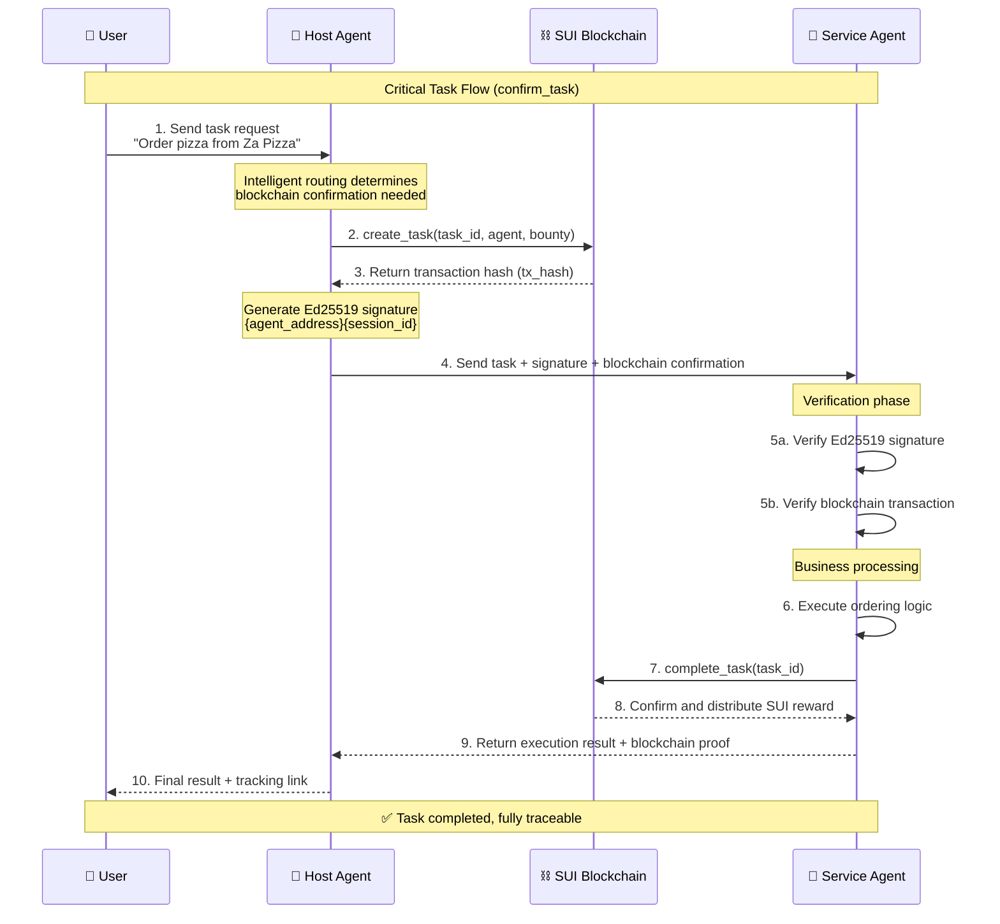
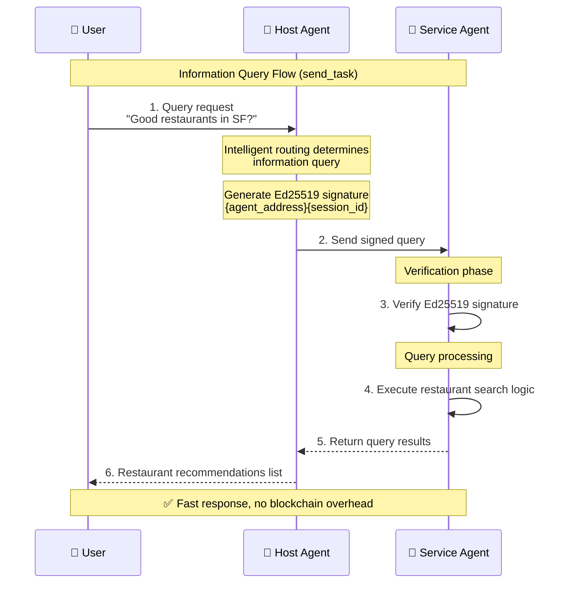

# PIN A2A: SUI-Powered Agent Collaboration Platform

[](https://opensource.org/licenses/MIT)
[](https://www.python.org/downloads/)
[](https://sui.io/)
[](https://a2a.to/)

> **An innovative open-source platform that integrates Google A2A Protocol with SUI blockchain, providing secure and efficient infrastructure for multi-agent systems**

---

## 🚀 Project Overview

PIN A2A is an innovative agent collaboration platform that integrates **Google A2A (Agent-to-Agent) Protocol** with **SUI blockchain**, providing secure, efficient, and scalable infrastructure for AI Agent ecosystems.

### Core Value Propositions

- 🔐 **Enhanced Security**: Ed25519 digital signatures + SUI blockchain task confirmation for trusted inter-agent communication
- ⚡ **High Performance**: Fast transaction processing leveraging SUI's parallel execution capabilities
- 🔄 **Protocol Compatibility**: Fully compatible with Google A2A specifications for seamless Agent integration
- 💰 **Decentralized Incentives**: On-chain task management with automatic reward distribution
- 🌐 **Flexible Architecture**: Modular Agent design supporting diverse application domains

---

## 🎬 System Demonstrations

### Demo Videos


#### 1. Host Agent + Food Agent Interaction Demo


https://github.com/user-attachments/assets/4b3e7b8f-101d-4265-ab40-5471db140643


**Demo Highlights:**
- User initiates food ordering request
- Host Agent creates blockchain task
- Food Agent verifies signature and blockchain confirmation
- Completes order processing and blockchain task confirmation
- Real-time task status updates

#### 2. Host Agent + Uber Agent Interaction Demo

https://github.com/user-attachments/assets/02f0d3fb-b3b3-48a0-98b8-75ccd4b0d9c7


**Demo Highlights:**
- Ride-hailing service request processing
- Intelligent task routing decisions
- Ed25519 signature verification process
- Blockchain task lifecycle management
- Error handling and graceful degradation

### Technical Highlight Showcase

- ✅ **Fast Blockchain Confirmation**: High-performance advantages of SUI network's parallel execution
- ✅ **Zero Trust Architecture**: Every interaction has cryptographic verification
- ✅ **Plugin Extensibility**: Rapid integration of new Agent types
- ✅ **Complete Traceability**: All critical operations are verifiable on-chain

---

## 🏗️ System Architecture

### Core Component Architecture

### Technology Stack Overview

| Layer | Technology Components | Description |
|-------|----------------------|-------------|
| **Blockchain Layer** | SUI Blockchain | High-performance L1 blockchain with parallel execution and Move smart contracts |
| **Protocol Layer** | Google A2A Protocol | Standardized inter-agent communication protocol |
| **Framework Layer** | Google ADK | AI Agent Development Kit |
| **Application Layer** | Host Agent + Service Agents | Task coordinator + specialized service agents |
| **Security Layer** | Ed25519 + On-chain Verification | Digital signatures + SUI blockchain task confirmation |

---

## 🔥 Core Technical Features

### 1. 🔐 Blockchain-Enhanced Trust Mechanism

#### Ed25519 Digital Signature Verification
- **Host Agent Signing**: Uses private key to sign `{agent_address}{session_id}`
- **Service Agent Verification**: Verifies signature source and session legitimacy
- **Replay Attack Prevention**: Session ID ensures uniqueness of each interaction

#### On-Chain Task Lifecycle Management
```
┌─────────────┐    ┌──────────────┐    ┌─────────────┐
│ Task Created │ -> │ Task Executed │ -> │ Task Completed │
│ create_task  │    │ Business Logic│    │ complete_task │
│ (Host Agent) │    │(Service Agent)│    │(Service Agent)│
└─────────────┘    └──────────────┘    └─────────────┘
```

### 2. ⚡ High-Performance Async Architecture

- **Concurrent Processing**: Supports parallel execution of multiple tasks
- **Streaming Communication**: Real-time task status updates (SSE)
- **Graceful Degradation**: Automatic switch to normal mode during blockchain failures
- **Intelligent Routing**: Automatic processing mode selection based on task type

### 3. 🔄 Standardized A2A Protocol Integration

#### Supported A2A Methods
| Method | Purpose | Blockchain Integration |
|--------|---------|----------------------|
| `tasks/send` | Synchronous task execution | ✅ Signature verification |
| `tasks/sendSubscribe` | Streaming task execution | ✅ Signature verification |
| `tasks/get` | Task status query | - |
| `tasks/cancel` | Task cancellation | 🔄 Planned |
| `/.well-known/agent.json` | Agent capability discovery | ✅ Includes blockchain address |

---

## 🌊 System Workflows

### Critical Task Flow (confirm_task)

Applicable scenarios: Tasks involving real-world operations (food ordering, ride-hailing, bookings, etc.)



### Information Query Flow (send_task)

Applicable scenarios: Pure information queries without blockchain confirmation needed



---

## 🛠️ Technology Stack

### Backend Technologies
- **Language**: Python 3.11+
- **Package Manager**: uv (fast Python package manager)
- **AI Framework**: Google ADK (Agent Development Kit)
- **LLM**: Google Gemini 2.0 Flash
- **Blockchain**: SUI Python SDK
- **Async**: asyncio + uvicorn
- **Cryptography**: PyNaCl (Ed25519 signatures)

### Blockchain Technologies
- **Smart Contracts**: Move language
- **Network**: SUI Testnet (scalable to Mainnet)
- **Consensus**: Narwhal & Bullshark (High throughput)
- **Signature Algorithm**: Ed25519
- **Parallel Execution**: SUI's object-centric model

### Deployment Technologies
- **Containerization**: Docker + Docker Compose
- **Service Discovery**: A2A Agent Cards
- **Monitoring**: Structured logging + blockchain explorer integration

---

## 🚀 Quick Start

### Prerequisites

- Python 3.11+
- [uv](https://astral.sh/uv/) (fast Python package manager)
- Google API Key (Gemini)
- Node.js 18+ (for SUI blockchain interactions)

### 1. Clone Repository

```bash
git clone https://github.com/PIN-AI/pin-a2a.git
cd pin-a2a
```

### 2. Environment Setup with uv

```bash
# Install uv if not already installed
curl -LsSf https://astral.sh/uv/install.sh | sh

# Setup project environment
./setup_uv.sh

# Or manually:
uv sync
uv add --group test pytest pytest-asyncio pytest-mock pytest-cov
```

### 3. Environment Configuration

```bash
# Environment variables are already configured in .env
# Key variables:
# SUI_NETWORK=testnet
# TASK_AGENT_PRIVATE_KEY=suiprivkey1...
# SERVICE_AGENT_PRIVATE_KEY=suiprivkey1...
# TASK_MANAGER_PACKAGE_ID=0x...
# TASK_MANAGER_ID=0x...
```

### 4. Quick Start Options

```bash
# Option 1: Run tests to verify setup
make test

# Option 2: Run demo
make demo

# Option 3: Start agents manually
# Terminal 1: Start Food Agent
uv run python samples/python/agents/food_ordering_services/main.py

# Terminal 2: Start Host Agent UI
uv run python samples/python/host_agent/main.py
```

### 5. Access Interfaces

- **Host Agent UI**: http://localhost:8080
- **Food Agent API**: http://localhost:10003
- **Agent Cards**: http://localhost:10003/.well-known/agent.json

### 6. Available Commands

```bash
# View all available commands
make help

# Run specific test types
make test-unit              # Unit tests
make test-integration       # Integration tests  
make test-compatibility     # Compatibility tests
make test-coverage          # Tests with coverage report

# Development commands
make install-dev           # Install development dependencies
make lint                  # Code style check
make format                # Format code
make clean                 # Clean temporary files
make env-check            # Check environment configuration
```

---

## 🤝 Contributing

We welcome contributions from the community! Please see [CONTRIBUTING.md](CONTRIBUTING.md) for detailed information.

### How to Participate

- 🐛 **Report Bugs**: Describe issues in detail in Issues
- 💡 **Feature Suggestions**: Propose new Agent types or functionality ideas
- 🔧 **Code Contributions**: Submit Pull Requests
- 📖 **Documentation Improvements**: Enhance technical docs and tutorials
- 🌐 **Community Building**: Promote the project, organize technical sharing

---

## 📄 License

This project is licensed under the [MIT License](LICENSE).

---

## 📞 Contact Us

- **Project Homepage**: https://github.com/PIN-AI/pin-a2a
- **Official Website**: https://www.pinai.io
- **Documentation**: See [README_UV.md](README_UV.md) for detailed uv usage guide

---

<div align="center">

**🌟 If this project helps you, please give us a Star!**

[](https://github.com/PIN-AI/pin-a2a/stargazers)

</div> 
